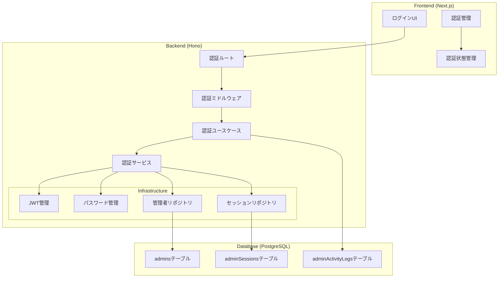
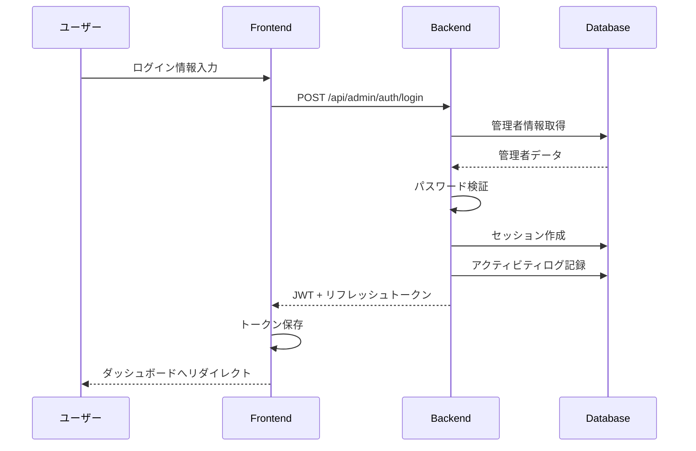
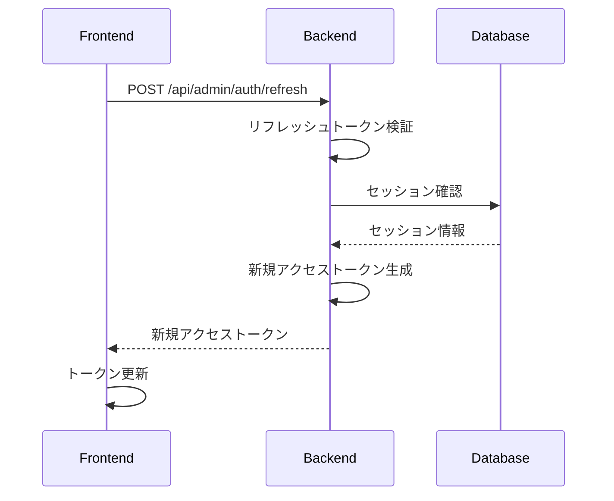

# 管理者認証アーキテクチャ

## 概要

管理者認証システムは、システム管理者がWebアプリケーションの管理機能にアクセスするための認証・認可機能を提供します。

## アーキテクチャ概要



## 主要コンポーネント

### 1. フロントエンド層

#### 認証UI
- ログインフォーム
- エラー表示
- ローディング状態管理

#### 認証管理
- JWTトークンの保存・管理
- 自動リフレッシュ
- ログアウト処理

#### 認証状態管理
- グローバル認証状態
- ユーザー情報キャッシュ
- 権限情報管理

### 2. バックエンド層

#### 認証ルート
- `/api/admin/auth/login` - ログイン
- `/api/admin/auth/logout` - ログアウト
- `/api/admin/auth/refresh` - トークンリフレッシュ
- `/api/admin/auth/me` - ユーザー情報取得

#### 認証ミドルウェア
- JWTトークン検証
- 権限チェック
- リクエストコンテキストへのユーザー情報注入

#### ユースケース層
- ログインユースケース
- ログアウトユースケース
- トークンリフレッシュユースケース

#### ドメインサービス
- 認証ビジネスロジック
- パスワード検証
- セッション管理

### 3. インフラストラクチャ層

#### JWT管理
- トークン生成・検証
- クレーム管理
- 有効期限管理

#### パスワード管理
- ハッシュ生成（bcrypt/argon2）
- パスワード検証
- パスワードポリシー適用

#### リポジトリ
- 管理者情報の永続化
- セッション情報の管理
- アクティビティログの記録

## 認証フロー

### ログインフロー



### トークンリフレッシュフロー



## データモデル

### 管理者 (admins)
```typescript
interface Admin {
  id: string;
  username: string;
  email: string;
  passwordHash: string;
  role: 'SUPER_ADMIN' | 'ADMIN';
  permissions: string[];
  isActive: boolean;
  lastLoginAt: Date | null;
  failedLoginAttempts: number;
  lockedUntil: Date | null;
}
```

### セッション (adminSessions)
```typescript
interface AdminSession {
  id: string;
  adminId: string;
  refreshToken: string;
  ipAddress: string;
  userAgent: string;
  expiresAt: Date;
  createdAt: Date;
}
```

### アクティビティログ (adminActivityLogs)
```typescript
interface AdminActivityLog {
  id: string;
  adminId: string;
  action: string;
  details: Record<string, any>;
  ipAddress: string;
  userAgent: string;
  createdAt: Date;
}
```

## セキュリティ考慮事項

### 1. パスワード保護
- bcrypt または argon2 によるハッシュ化
- 適切なコスト係数の設定
- パスワードポリシーの適用

### 2. トークン管理
- 短い有効期限のアクセストークン（1時間）
- 長い有効期限のリフレッシュトークン（7日間）
- トークンのブラックリスト機能

### 3. セッション管理
- デバイス別セッション管理
- 同時ログイン数制限（オプション）
- 自動ログアウト機能

### 4. 攻撃対策
- ブルートフォース攻撃対策（レート制限）
- アカウントロック機能
- ログイン試行の記録

### 5. 監査
- すべての認証イベントのログ記録
- 不正アクセスの検知
- 定期的なログレビュー

## 拡張性

### 将来の拡張ポイント
1. **多要素認証（MFA）**
   - TOTP（Time-based One-Time Password）
   - SMS認証
   - メール認証

2. **シングルサインオン（SSO）**
   - SAML 2.0
   - OAuth 2.0
   - OpenID Connect

3. **高度なセッション管理**
   - デバイス認識
   - 地理的位置の確認
   - 異常検知

4. **権限管理の高度化**
   - 動的権限付与
   - 権限の階層化
   - カスタムロール