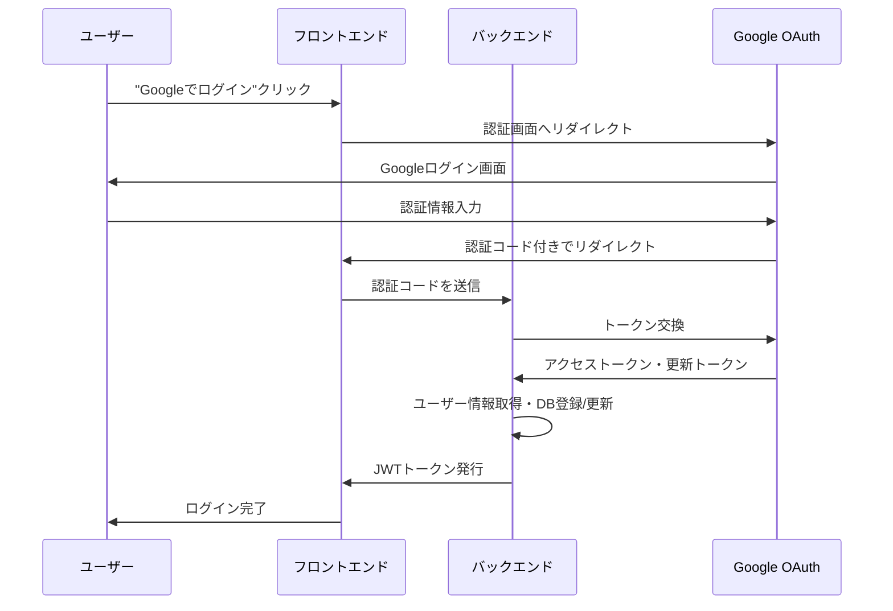

# Google アカウント連携設計

## 概要
ユーザーの利便性とセキュリティを両立するため、Googleアカウント連携（OAuth 2.0）を実装します。パスワード管理の負担を軽減し、既存のGoogleアカウントでシームレスにサービスを利用できるようにします。

## 認証方式の設計

### 1. ハイブリッド認証モデル
ユーザーに選択肢を提供し、段階的に移行を促します。

```typescript
// ユーザー認証方法
enum AuthProvider {
  LOCAL = 'local',      // メール/パスワード
  GOOGLE = 'google',    // Google OAuth
  // 将来的に追加可能
  // TWITTER = 'twitter',
  // DISCORD = 'discord',
}
```

### 2. テーブル設計

#### users テーブル（改訂版）
```sql
CREATE TABLE users (
  id VARCHAR(36) PRIMARY KEY,
  username VARCHAR(30) UNIQUE,         -- NULL可（Google連携時は自動生成）
  email VARCHAR(100) UNIQUE NOT NULL,
  display_name VARCHAR(50),
  avatar_url VARCHAR(500),
  bio TEXT,
  is_active BOOLEAN DEFAULT TRUE,
  preferred_language VARCHAR(5) DEFAULT 'ja',
  notification_settings JSON,
  privacy_settings JSON,
  last_login_at TIMESTAMP,
  created_at TIMESTAMP DEFAULT CURRENT_TIMESTAMP,
  updated_at TIMESTAMP DEFAULT CURRENT_TIMESTAMP
);
```

#### user_auth_providers テーブル（新規）
```sql
CREATE TABLE user_auth_providers (
  id VARCHAR(36) PRIMARY KEY,
  user_id VARCHAR(36) NOT NULL,
  provider VARCHAR(20) NOT NULL,        -- 'local', 'google'
  provider_user_id VARCHAR(255),        -- GoogleのユーザーID
  email VARCHAR(100) NOT NULL,
  password_hash VARCHAR(255),           -- localの場合のみ
  access_token TEXT,                    -- OAuthトークン（暗号化）
  refresh_token TEXT,                   -- リフレッシュトークン（暗号化）
  token_expires_at TIMESTAMP,
  is_primary BOOLEAN DEFAULT FALSE,     -- 主要な認証方法
  created_at TIMESTAMP DEFAULT CURRENT_TIMESTAMP,
  updated_at TIMESTAMP DEFAULT CURRENT_TIMESTAMP,
  
  FOREIGN KEY (user_id) REFERENCES users(id) ON DELETE CASCADE,
  UNIQUE KEY unique_provider_user (provider, provider_user_id),
  INDEX idx_user_provider (user_id, provider)
);
```

## Google OAuth 2.0 実装

### 1. 認証フロー


### 2. 実装コード例

#### バックエンド実装
```typescript
// src/services/auth/google-auth.service.ts
import { OAuth2Client } from 'google-auth-library';

export class GoogleAuthService {
  private client: OAuth2Client;
  
  constructor() {
    this.client = new OAuth2Client(
      process.env.GOOGLE_CLIENT_ID,
      process.env.GOOGLE_CLIENT_SECRET,
      process.env.GOOGLE_REDIRECT_URI
    );
  }
  
  // 認証URLの生成
  getAuthUrl(): string {
    return this.client.generateAuthUrl({
      access_type: 'offline',
      scope: [
        'https://www.googleapis.com/auth/userinfo.profile',
        'https://www.googleapis.com/auth/userinfo.email'
      ],
      prompt: 'consent'
    });
  }
  
  // Googleトークンの検証とユーザー情報取得
  async verifyAndGetUser(code: string) {
    const { tokens } = await this.client.getToken(code);
    this.client.setCredentials(tokens);
    
    // ユーザー情報を取得
    const ticket = await this.client.verifyIdToken({
      idToken: tokens.id_token!,
      audience: process.env.GOOGLE_CLIENT_ID!
    });
    
    const payload = ticket.getPayload();
    return {
      googleId: payload!.sub,
      email: payload!.email!,
      name: payload!.name,
      picture: payload!.picture,
      emailVerified: payload!.email_verified
    };
  }
}
```

#### ユーザー登録・ログイン処理
```typescript
// src/services/auth/auth.service.ts
export class AuthService {
  async googleAuth(code: string) {
    // Google認証
    const googleUser = await this.googleAuth.verifyAndGetUser(code);
    
    // 既存ユーザーチェック
    let user = await this.userRepo.findByEmail(googleUser.email);
    
    if (!user) {
      // 新規ユーザー作成
      user = await this.createGoogleUser(googleUser);
    } else {
      // 既存ユーザーの場合、Google連携を追加/更新
      await this.linkGoogleAccount(user.id, googleUser);
    }
    
    // JWTトークン生成
    const token = this.generateJWT(user);
    
    // ログイン履歴更新
    await this.updateLoginHistory(user.id);
    
    return { user, token };
  }
  
  private async createGoogleUser(googleUser: GoogleUserInfo) {
    // トランザクション内で実行
    return await this.db.transaction(async (trx) => {
      // ユーザー作成
      const user = await this.userRepo.create({
        email: googleUser.email,
        username: await this.generateUniqueUsername(googleUser.email),
        display_name: googleUser.name,
        avatar_url: googleUser.picture,
        is_active: true
      }, trx);
      
      // 認証プロバイダー情報追加
      await this.authProviderRepo.create({
        user_id: user.id,
        provider: 'google',
        provider_user_id: googleUser.googleId,
        email: googleUser.email,
        is_primary: true
      }, trx);
      
      return user;
    });
  }
}
```

### 3. フロントエンド実装
```typescript
// src/hooks/useGoogleAuth.ts
export const useGoogleAuth = () => {
  const login = async () => {
    // Google認証画面へリダイレクト
    window.location.href = `${API_URL}/api/auth/google`;
  };
  
  const handleCallback = async (code: string) => {
    try {
      const response = await fetch(`${API_URL}/api/auth/google/callback`, {
        method: 'POST',
        headers: { 'Content-Type': 'application/json' },
        body: JSON.stringify({ code })
      });
      
      const { token, user } = await response.json();
      
      // トークンを保存
      localStorage.setItem('auth_token', token);
      
      // ユーザー情報を状態管理に保存
      setUser(user);
      
      // ダッシュボードへリダイレクト
      router.push('/dashboard');
    } catch (error) {
      console.error('Google認証エラー:', error);
    }
  };
  
  return { login, handleCallback };
};
```

## セキュリティ考慮事項

### 1. トークン管理
```typescript
// アクセストークンとリフレッシュトークンの暗号化
class TokenEncryption {
  private algorithm = 'aes-256-gcm';
  private key = Buffer.from(process.env.ENCRYPTION_KEY!, 'hex');
  
  encrypt(text: string): string {
    const iv = crypto.randomBytes(16);
    const cipher = crypto.createCipheriv(this.algorithm, this.key, iv);
    
    let encrypted = cipher.update(text, 'utf8', 'hex');
    encrypted += cipher.final('hex');
    
    const authTag = cipher.getAuthTag();
    
    return iv.toString('hex') + ':' + authTag.toString('hex') + ':' + encrypted;
  }
  
  decrypt(encryptedData: string): string {
    const parts = encryptedData.split(':');
    const iv = Buffer.from(parts[0], 'hex');
    const authTag = Buffer.from(parts[1], 'hex');
    const encrypted = parts[2];
    
    const decipher = crypto.createDecipheriv(this.algorithm, this.key, iv);
    decipher.setAuthTag(authTag);
    
    let decrypted = decipher.update(encrypted, 'hex', 'utf8');
    decrypted += decipher.final('utf8');
    
    return decrypted;
  }
}
```

### 2. CSRF対策
```typescript
// State パラメーターを使用したCSRF対策
const generateState = () => {
  return crypto.randomBytes(32).toString('hex');
};

// セッションに保存
session.oauth_state = generateState();

// Google認証URLに含める
const authUrl = googleClient.generateAuthUrl({
  state: session.oauth_state,
  // ... その他のパラメーター
});

// コールバック時に検証
if (request.query.state !== session.oauth_state) {
  throw new Error('Invalid state parameter');
}
```

### 3. アカウント連携のセキュリティ
```typescript
// 既存アカウントとの連携時の確認
async linkGoogleAccount(userId: string, googleUser: GoogleUserInfo) {
  // メールアドレスの所有確認
  const existingUser = await this.userRepo.findByEmail(googleUser.email);
  
  if (existingUser && existingUser.id !== userId) {
    throw new Error('このメールアドレスは既に別のアカウントで使用されています');
  }
  
  // 連携を追加
  await this.authProviderRepo.create({
    user_id: userId,
    provider: 'google',
    provider_user_id: googleUser.googleId,
    email: googleUser.email
  });
}
```

## ユーザー体験の最適化

### 1. 初回ログイン時の追加情報収集
```typescript
// Google認証後、追加情報が必要な場合
interface UserOnboarding {
  username?: string;      // 未設定の場合は選択を促す
  preferred_language?: string;
  notification_preferences?: object;
}
```

### 2. アカウント管理画面
```tsx
// アカウント設定画面での認証方法管理
const AccountSettings = () => {
  return (
    <div>
      <h3>認証方法</h3>
      <div>
        <GoogleIcon /> Google アカウント
        {user.hasGoogleAuth ? (
          <Button variant="outline" onClick={unlinkGoogle}>連携解除</Button>
        ) : (
          <Button onClick={linkGoogle}>連携する</Button>
        )}
      </div>
      
      {!user.hasLocalAuth && (
        <Alert>
          パスワードを設定すると、メールアドレスでもログインできるようになります
        </Alert>
      )}
    </div>
  );
};
```

### 3. 複数認証方法の管理
```typescript
// ユーザーは複数の認証方法を持てる
class AuthManager {
  // 主要な認証方法の切り替え
  async setPrimaryAuth(userId: string, provider: AuthProvider) {
    await this.db.transaction(async (trx) => {
      // 全ての認証方法のprimaryをfalseに
      await trx('user_auth_providers')
        .where({ user_id: userId })
        .update({ is_primary: false });
      
      // 指定された認証方法をprimaryに
      await trx('user_auth_providers')
        .where({ user_id: userId, provider })
        .update({ is_primary: true });
    });
  }
  
  // 認証方法の削除（最低1つは必要）
  async removeAuthProvider(userId: string, provider: AuthProvider) {
    const authMethods = await this.getAuthMethods(userId);
    
    if (authMethods.length <= 1) {
      throw new Error('最低1つの認証方法が必要です');
    }
    
    await this.authProviderRepo.delete({ user_id: userId, provider });
  }
}
```

## 移行戦略

### 既存ユーザーへの対応
1. **オプトイン方式**: 既存ユーザーは任意でGoogle連携を追加
2. **メール通知**: Google連携の利点を説明し、移行を促す
3. **インセンティブ**: 連携ユーザーに特典を提供

### 段階的導入
1. **Phase 1**: 新規ユーザーのみGoogle認証オプション提供
2. **Phase 2**: 既存ユーザーへの連携機能開放
3. **Phase 3**: Google認証をデフォルトに（従来方式も維持）

## まとめ
Google認証を導入することで：
- ✅ パスワード忘れの問題を解消
- ✅ セキュアな認証（Googleの2段階認証を活用）
- ✅ スムーズな登録・ログイン体験
- ✅ 将来的な他サービス連携への拡張性